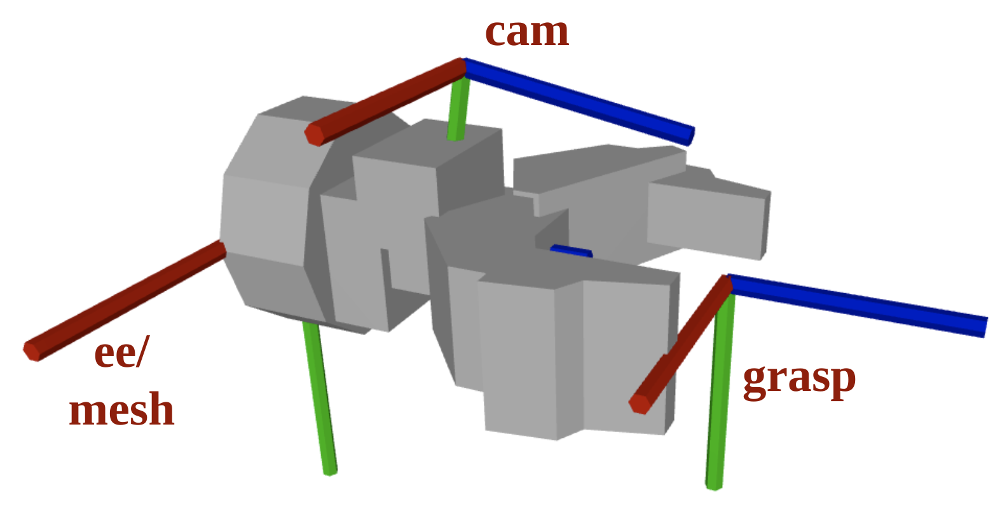
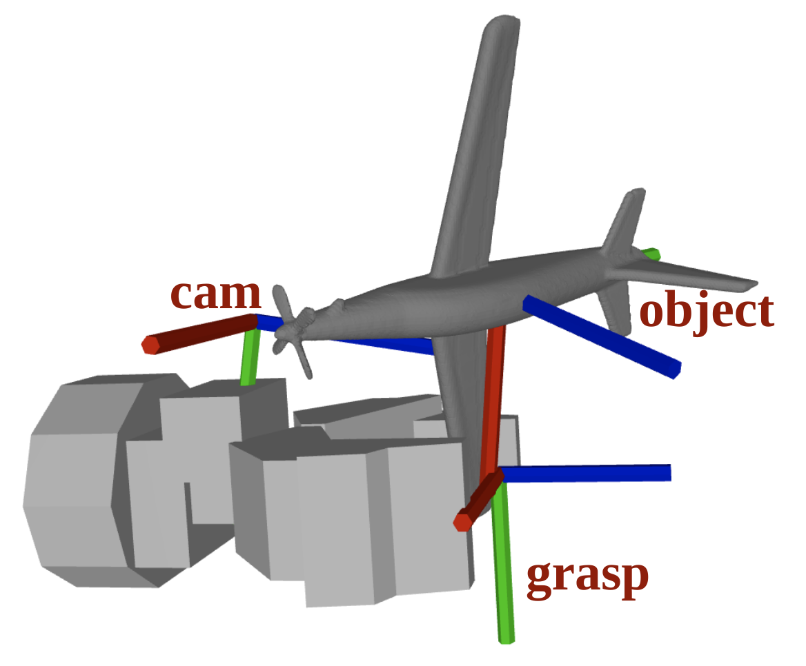

# Closed Loop Grasping Grasp Evaluator Network Installation

These steps have been tested for Ubuntu 20.04 with CUDA 11.6, Python 3.8.10

## Prerequisites
- CUDA installation with corresponding nvidia drivers


## Environment setup

1. Clone this repository in your folder of choice

        git clone https://gitlab.saicny.com/saic-ny/closed_loop_grasping.git

2. Create a python virtual environment inside the repo, source it and update pip. (Try virtualenv if pytorch3d installation complains about ```No module named 'torch'```)

        cd closed_loop_grasping
        python3 -m venv pyvenv
        source pyvenv/bin/activate
        pip install --upgrade pip

3. Install pytorch for your specific CUDA version. To install torch based on your CUDA version, see here: https://pytorch.org/get-started/locally/. In my case for CUDA 11.6 the right command is

        pip3 install torch torchvision torchaudio --extra-index-url https://download.pytorch.org/whl/cu116


4. Create a new directory called "extern" in the root of the repo

        mkdir -p extern && cd extern


5. Use the following installation script to install Isaac Gym, clone and setup SceneCollisionNet, Acronym and Manifold:

        ../installation.sh


6. Now download ACRONYM grasp dataset as well as ShapeNetSem corresponding meshes. Like before, replace "your_user" accordingly

        scp -r your_user@lambda00.saicny.com:/labdata/ppiacenza/closed_loop_grasping/acronym.tar.gz ./
        tar -xvzf acronym.tar.gz -C acronym/data/
        rm -rf acronym.tar.gz

        scp -r your_user@lambda00.saicny.com:/labdata/ppiacenza/closed_loop_grasping/ShapeNetSem_models-OBJ.zip ./
        unzip ShapeNetSem_models-OBJ.zip -d acronym/data/
        rm -rf ShapeNetSem_models-OBJ.zip


7. Generate dataset linking ACRONYM grasps and ShapeNetSem meshes. This process also processes meshes to make them watertight and simplify them. Lastly, it also samples stable poses for the meshes to be used later in our simulation.
This will generate "positive grasps" "negative grasps" and "hard negative grasps".
All grasp poses are aligned with the grasp point in SceneGrasp convention, which is the fingertip center when the gripper closes.
Make sure to run this command from the root of the repo

        cd ..
        python3 tools/generate_acronym_dataset.py extern/acronym/data/models/ extern/acronym/data/grasps/ ./dataset

        # To generate the ACRONYM dataset with only bowl for testing, use:
        rm dataset/object_info.hdf5
        python3 tools/generate_bowl_dataset.py -m extern/acronym/data/models/ -g extern/acronym/data/grasps/ -o ./dataset

8. You can also use ```tools/select_object_category.py``` or ```tools/select_object_mesh.py``` to select a subset from the whole ACRONYM dataset based on object category and trim some of the meshes in each selected category. The result will be output as a YAML file in ```./config/```. We provide a pre-generated file ```config/object_mesh_dict.yaml```.

9. To visualize the grasp poses ACRONYM dataset:

        python scripts/visualize_acronym_grasps.py \
                --env_param_file config/GraspEvaNet_Dataset_SR_Gripper.yaml \
                --mesh_dict_file config/object_mesh_dict.yaml \
                --grasp_label positive_grasps \
                --cat_idx 0 \
                --mesh_idx 0

9. Install the rest of the required packages:

        pip install -r requirements.txt


10. Clone and install Pytorch PointNet++

        git clone git@github.com:erikwijmans/Pointnet2_PyTorch.git
        cd Pointnet2_PyTorch/
        pip install -r requirements.txt


11. Install pytorch3d

        pip install "git+https://github.com/facebookresearch/pytorch3d.git@stable"


## Wrist camera point cloud generation for Grasp Evaluator Network

See ```scripts/grasp_dataset_generator.py``` for details of dataset file structures.

### GraspEvaNet dataset generation pipeline

GraspEvaNet dataset generation requires two YAML file to set up the render environment.

        --env_param_file :  Gripper and camera configurations, point cloud processing parameters
        --mesh_dict_file :  Mesh category and mesh id

Generate data for one object:

        python scripts/generate_grasp_evaluation_dataset.py \
                --env_param_file config/GraspEvaNet_Dataset_SR_Gripper.yaml \
                --mesh_dict_file config/object_mesh_dict.yaml \
                --output_dir grasp_pcd_dataset \
                --mesh_list_index 0

Generate data for multiple objects:

        python run_dataset_generator.py \
                --env_param_file config/GraspEvaNet_Dataset_SR_Gripper.yaml \
                --mesh_dict_file config/object_mesh_dict.yaml \
                --output_dir grasp_pcd_dataset \
                --scene_start_index 0 \
                --num_scenes 10

### Dataset point cloud visualization
To visualize generated point cloud colored according to the segmentation ID, use 

``` 
        python3 scripts/visualize_pcd_dataset.py 
```
You need to manually change the pcd file path to visualize

## Other utility scripts

1. Sample point cloud from gripper mesh and save it for gripper concatenation in dataset generation steps:

        python scripts/sample_gripper_points.py

2. Visualize GraspEvaNet dataset:

        python scripts/visualize_pcd_dataset.py

## Customize gripper and camera configuration

1. Change point cloud crop size:
   
   Modify ```pmin``` and ```pmax``` for different bounding box sizes. The default is shown here:

   

2. Change camera and gripper configurations

   **Note** the camera pose here is different from what PyRender uses. PyRender uses OpenGL convention with z-axis pointing backward. See [this link](https://pyrender.readthedocs.io/en/latest/examples/cameras.html) for more details. This difference is addressed with an additional tranformation matrix ```opencv_t_opengl``` in ```RenderEnvironment```.

   Modify ```grasp_t_ee``` and ```ee_t_cam``` and use the following script to visualize and verify. 

        python scripts/visualzie_env_frame
   
   The frame conventions are shown here:

   
   
