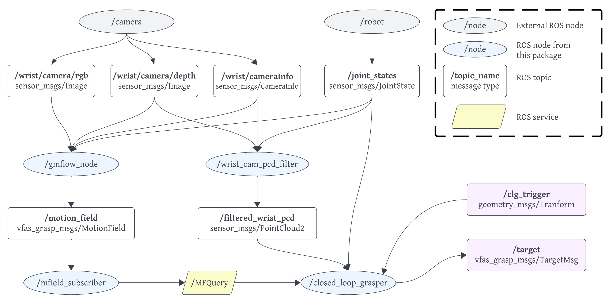
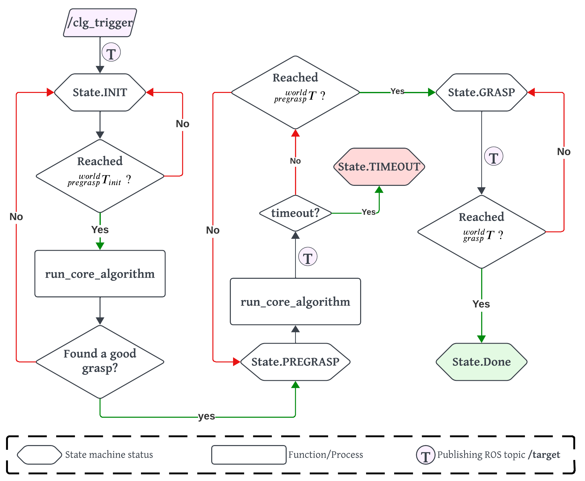

# Closed Loop Grasping ROS Packages

These steps have been tested for Ubuntu 20.04 with CUDA 11.6, Python 3.8.10

## Prerequisites

- If you have already set up the Python virtual environment during data collection and training for the grasp evaluator network, you can skip the following steps:
  
  - CUDA installation with corresponding nvidia drivers
  
  - In Python virtual environment, install pytorch for your specific CUDA version. For example, for CUDA 11.6:

        pip3 install torch torchvision torchaudio --extra-index-url https://download.pytorch.org/whl/cu116
  - Install pytorch3d

        pip install "git+https://github.com/facebookresearch/pytorch3d.git@stable"

  - Clone and install Pytorch PointNet++

        git clone git@github.com:erikwijmans/Pointnet2_PyTorch.git
        cd Pointnet2_PyTorch/
        pip install -r requirements.txt

  - Install the rest of the required packages:

        pip install -r requirements.txt

- Add PYTHONPATH. Replace <PATH_TO_VIRTUAL_ENV> in the following command with your python virtual environment path:

        export PYTHONPATH=${PYTHONPATH}:<PATH_TO_VIRTUAL_ENV>

- Grasp-Evaluator-Network weights, gripper mesh and mask
  
  - Place the network checkpoint file in ```/vfas_code_release/ros_pkgs/closed_loop_grasping/resources/```. Replace <MODEL_CHECKPOINT> accordingly in [the YAML file](./closed_loop_grasping/config/clg_params.yaml). 
  
        model_file: <MODEL_CHECKPOING>

  - Make sure the pre-computed point cloud in ```/vfas_code_release/ros_pkgs/closed_loop_grasping/resources/``` is the same as the one in ```/vfas_code_release/data_and_training/resources/```.
  Replace <GRIPPER_POINT_CLOUD> accordingly in [the YAML file](./closed_loop_grasping/config/clg_params.yaml). 

        gripper_points: <GRIPPER_POINT_CLOUD>
  
  - ```/vfas_code_release/ros_pkgs/closed_loop_grasping/resources/finger_mask.png``` is the finger occlusion mask. Pixels with value larger than zero correspond to finger areas. Please refer to the [code](./closed_loop_grasping/closed_loop_grasping/wrist_cam_pcd_filter.py) for more details.

- Pose Calculator

  - Both **```/motion_field```** and **```/filtered_wrist_pcd```** are in the robot base frame. **```/closed_loop_grasper```** node also regularly checks the distance between the current grasp pose and the target grasp pose. 
  - Instead of using TF from ROS to get the frame transformations, we defined a class [here](./closed_loop_grasping/closed_loop_grasping/pose_calculator.py) that is initialized with the robot URDF file and the camera extrinsics file. The exact implementation varies across robot models so we leave this to the users. We also provided an example in the comments. 

- ROS parameters

  - Modify the names of the links/topics in [the YAML file](./closed_loop_grasping/config/clg_params.yaml) according to your system. 

# Interfacing with this Package

The rqt-styled graph for the system and interfaces are shown here:



The topics to interface with this package are **```/clg_trigger```** and **```/target```**

- **```/clg_trigger```** 
  - message type: ```geometry_msgs/Transform```
  - This could be the grasp pose proposed by the global grasp planner (e.g. [ContactGraspNet](https://github.com/NVlabs/contact_graspnet)) using external camera. 


- **```/target```** 
  - message type: ```vfas_grasp_msgs/TargetMsg```
    - ```/target/home```: if ```True```, the subscriber node should define a ```HOME``` pose and send the robot home. Since the home configuration varies across robot manipulator types, we will leave this implementation to the users.
    - ```/target/goal_pose```: the target grasp pose. It is intended to be used only when ```/target/home``` is ```False```

Everytime **```/closed_loop_grasper```** node receives a message **```/clg_trigger```**, the callback function will run once in blocking mode until an error or timeout. We implemented a state machine for the transitions between different stages of the closed-loop grasping process. The callback function can be summarized by the figure below. The publishing steps for **```/target_msg```** is abstracted by the purple circle. Please refer the [code](./closed_loop_grasping/closed_loop_grasping/closed_loop_grasper.py) for more details.

